# Implemented system architecture

This document describes the runtime that is actually defined by
`docker-compose.yml`, the Python services, and the monitoring configuration.
It is intentionally a local-development architecture: three Kafka brokers run
on one Docker host, use ZooKeeper (not KRaft), and share the Compose network.
This is an implementation reference, not a claim that every container or an
external LLM has been exercised. Current verification evidence and environment
limitations are in [PROJECT_STATUS.md](PROJECT_STATUS.md).

## 1. System overview

The normal path stays deterministic. AI extraction is an optional fallback;
synthetic tests share the workers but use a separate database:

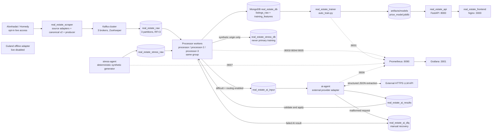

There is no Spark process, relational database, object store, or separate
Bronze/Silver/Gold lake. Those names are only logical descriptions of the
Mongo collections and Kafka topics below. The optional clean Kafka topic is an
audit/extension output; the trainer reads MongoDB directly.

## 2. End-to-end data flow

The configured sources are Alonhadat and Homedy; live crawling is disabled by
default. Guland has an offline-only adapter pending permission/live review.
Batdongsan is not registered as a selectable source. Contract/mapping evidence
is in [SOURCE_MIGRATION.md](SOURCE_MIGRATION.md). The optional
`python -m scraper.homedy_scraper` command is an **off-pipeline source trial**:
Homedy sale pages → raw-schema mapping → existing deterministic normalization /
validation → ignored `runtime/source_trials/` JSONL and report files. It has
no Kafka producer, Mongo persistence, scheduler, LLM call or trainer input, and
adds no Compose service or topic. The source's Organization/LocalBusiness
JSON-LD is not used as property location data; prices/area come from the main
listing panel, and unknown fields stay missing. Trial records are real source
data, not synthetic, so they must remain local until separately approved; the
synthetic filter is not their isolation mechanism. The partial 2026-09-10
result does not establish bulk-source readiness. See the
[trial command and boundaries](../README.md#alternative-source-trial-not-scheduled-ingestion)
and [evidence](PROJECT_STATUS.md#homedy-source-trial--2026-09-10).

1. `scraper/multi_source.py` uses source-specific adapters and robots-aware
   bounded HTTP. It emits canonical v2 records, preserving original units and
   source identity. `scripts/auto_scrape.py` schedules explicitly enabled runs
   and serves source metrics on 8008. Airflow is an optional paused alternative,
   not a simultaneous second crawler/trainer scheduler.
2. `scraper/kafka_producer.py` serializes one raw listing dictionary as UTF-8
   JSON and produces it to `real_estate_raw`. The Kafka key is the listing URL,
   so all updates for one URL remain ordered in one partition.
3. Three instances of `processing/kafka_to_mongo.py` join the same consumer
   group, `real_estate_training_pipeline`, subscribing to `real_estate_raw`,
   `real_estate_stress_raw` and `real_estate_ai_results`: nine partitions in
   total, not nine workers. Kafka assigns each partition to one current member.
   Offsets are not auto-committed or auto-stored.
4. A worker decodes and checks the live/stress boundary, archives the raw
   payload, normalizes values (including local text/geographic enrichment),
   validates, applies duplicate and
   price-IQR review, and upserts MongoDB by URL. Invalid records go to
   `invalid_records`; raw/feature database failures and deserialize failures
   are copied to `dlq_raw` where possible. A database failure is re-raised and
   leaves the source offset uncommitted; malformed bytes require durable DLQ
   persistence before commit. A normalized record is best-effort published to
   `real_estate_features`. The worker synchronously commits the Kafka offset
   after processing and records an `offset_checkpoint` document.
5. `scripts/auto_train.py` queries eligible `training_features` documents and
   periodically trains the scikit-learn model. Versioned joblib/metadata files
   and the stable `price_model.joblib` are written to the host-mounted
   `artifacts/` directory.
6. `modeling/api.py` loads the stable model on demand and exposes public
   registration/login plus authenticated model-info, single-prediction, and
   batch-prediction endpoints. The
   React/Vite frontend calls the API with a bearer token. `predictor` on port
   8002 is a separate legacy unauthenticated service and is not used by the
   frontend.
7. `stress-agent` generates finite, seeded, tagged variations from built-in
   structural templates or a bounded Mongo raw-record snapshot. It publishes
   only to `real_estate_stress_raw`; those records go to
   `real_estate_stress_db` with `is_model_candidate=false`. No primary trainer
   reads that database. Query filters and model-level filters also reject
   synthetic markers, including manual/JSON training.
8. When the relevant routing gate is enabled, missing/invalid required
   price/area/property-type fields plus usable source text cause a worker to
   acknowledge an AI request before committing the original record. An
   `ai-agent` consumes `real_estate_ai_input`, reuses cached output or calls the
   configured external HTTPS API, validates, saves extraction state, and
   acknowledges `real_estate_ai_results` before committing its request offset.
9. The same three Processors dispatch result messages to `agents/results.py`.
   It checks origin, source version and completed receipts, preserves original
   raw data, then reuses deterministic validation/review/storage with
   `skip_ai=True`. Failures go to Mongo `invalid_records`/`ai_failures` and an
   acknowledged Kafka `real_estate_ai_dlq` message before result commit.

`STRESS_ENABLED`, `AI_ENABLED`, `AI_FALLBACK_ENABLED` and `AI_STRESS_ENABLED`
default to false. AI requires the worker gate and the desired routing gate;
enabling real-data AI does not authorize synthetic API calls. When disabled,
`ai-agent` serves health/metrics but does not consume Kafka or require a key.

## 3. Kafka cluster topology

### Infrastructure

| Service/container | Image | Broker ID | Internal listener | Host listener | Coordination |
| --- | --- | ---: | --- | --- | --- |
| `kafka` / `real_estate_kafka_1` | `confluentinc/cp-kafka:7.5.3` | 1 | `kafka:29092` | `localhost:9092` | ZooKeeper `zookeeper:2181` |
| `kafka2` / `real_estate_kafka_2` | `confluentinc/cp-kafka:7.5.3` | 2 | `kafka2:29093` | `localhost:9093` | ZooKeeper `zookeeper:2181` |
| `kafka3` / `real_estate_kafka_3` | `confluentinc/cp-kafka:7.5.3` | 3 | `kafka3:29094` | `localhost:9094` | ZooKeeper `zookeeper:2181` |

ZooKeeper is `real_estate_zookeeper` (`cp-zookeeper:7.5.3`, port 2181). This
is a three-broker ZooKeeper-mode cluster, not a KRaft controller quorum. All
brokers use the `PLAINTEXT` inter-broker listener and are on Compose's default
network. They are separate broker processes but share the developer's single
host, so this demonstrates replication and rebalancing rather than host-level
high availability.

Each broker sets `KAFKA_NUM_PARTITIONS=3`,
`KAFKA_DEFAULT_REPLICATION_FACTOR=3`, `KAFKA_MIN_INSYNC_REPLICAS=2`, offsets
and transaction-log RF=3/min-ISR=2, unclean leader election disabled, and
group rebalance delay zero. `kafka-init` runs
[`scripts/init_kafka_cluster.sh`](../scripts/init_kafka_cluster.sh) after all
brokers are healthy. It creates/migrates application topics to three
partitions/RF3 and explicitly assigns replicas across broker IDs 1, 2, and 3;
it also requests RF3 reassignment for an existing `__consumer_offsets` topic.
It is a one-shot initialization container expected to exit with code 0. The
script does not wait for complete replica synchronization; its exit status
alone is not proof of healthy ISR. Existing-topic `min.insync.replicas` must
also be checked: `--create --if-not-exists` does not alter that setting.

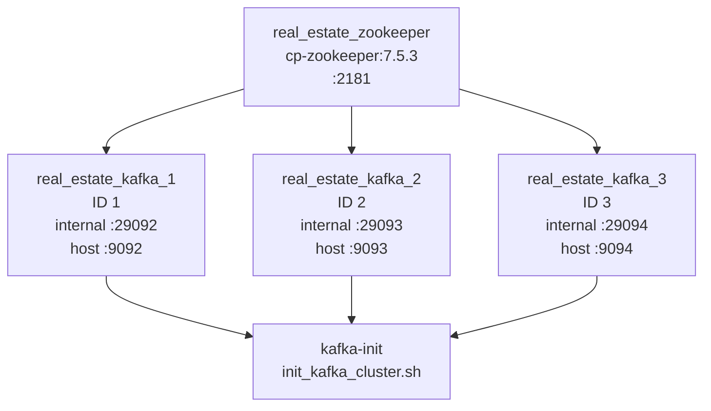

### Topics and contracts

| Topic | Partitions | Replication | Producer | Consumer/group | Payload and behavior |
| --- | ---: | ---: | --- | --- | --- |
| `real_estate_raw` (`KAFKA_RAW_TOPIC`) | 3 | 3 (min ISR 2) | Scraper producer | `processor`, `processor-2`, `processor-3` in `real_estate_training_pipeline` | One raw listing JSON object; key = URL; consumed from earliest; manual commit after Mongo processing |
| `real_estate_features` (`KAFKA_CLEAN_TOPIC`) | 3 | 3 (min ISR 2) | Each processor's best-effort producer | No consumer in this repository | Normalized JSON audit/extension feed, key = URL |
| `real_estate_stress_raw` (`KAFKA_STRESS_TOPIC`) | 3 | 3 (min ISR 2) | `stress-agent` | Same three Processors / `real_estate_training_pipeline` | Tagged synthetic JSON, key = synthetic URL; isolated Mongo destination |
| `real_estate_stress_features` | 3 | 3 (min ISR 2) | Processor stress-storage branch | No consumer in this repository | Best-effort synthetic audit stream, never trainer input |
| `real_estate_ai_input` (`KAFKA_AI_TOPIC`) | 3 | 3 (min ISR 2) | Processor fallback branch | `ai-agent` / `real_estate_ai_extraction` | Versioned source envelope, origin and event ID; key = URL; acknowledged hand-off |
| `real_estate_ai_results` (`KAFKA_AI_RESULT_TOPIC`) | 3 | 3 (min ISR 2) | `ai-agent` | Same three Processors / `real_estate_training_pipeline` | Original source envelope + validated success/failure result; key = URL |
| `real_estate_ai_dlq` (`KAFKA_AI_DLQ_TOPIC`) | 3 | 3 (min ISR 2) | AI worker for malformed requests; result handler for terminal failures | No automatic consumer | Recoverable failure envelope; key = event ID or URL, depending on producer |
| `__consumer_offsets` | Broker-managed; inspect runtime | 3 configured | Kafka group coordinator | Kafka internals | Consumer-group offsets; init requests RF3 for existing partitions |

No retention override is present, so Kafka broker defaults apply. Topic creation
is deterministic through `kafka-init` (auto-topic creation remains enabled for
compatibility). Partition assignment is key-based: the producer uses the URL
key and Kafka's default partitioner. Ordering is guaranteed only for records
with the same key/partition, not across topics or external API operations. The
diagram below illustrates the raw-topic slice only: assignments are dynamic,
not hardwired worker numbers. With the current identical three-topic
subscription and default range assignment, three Processors normally receive
one partition from each topic (three each). Raw ingestion itself remains
limited to three parallel partition owners. More workers do not create more raw
partitions; actual assignments must be checked with `kafka-consumer-groups`.
The separate AI consumer group has three input partitions and one worker by
default; optional AI replicas share those partitions, not independent groups.

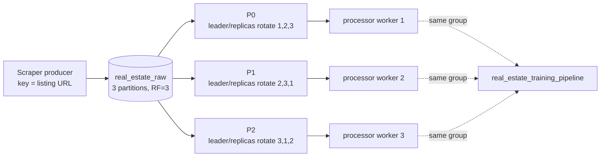

## 4. Docker / infrastructure topology

| Compose service | Container | Ports | Depends on | Volumes/config | Responsibility |
| --- | --- | --- | --- | --- | --- |
| `zookeeper` | `real_estate_zookeeper` | 2181 | — | — | Kafka coordination |
| `kafka` | `real_estate_kafka_1` | 9092, 29092 | zookeeper | broker ID 1/listeners | Kafka broker 1 |
| `kafka2` | `real_estate_kafka_2` | 9093, 29093 | zookeeper | broker ID 2/listeners | Kafka broker 2 |
| `kafka3` | `real_estate_kafka_3` | 9094, 29094 | zookeeper | broker ID 3/listeners | Kafka broker 3 |
| `kafka-init` | `real_estate_kafka_init` | — | all three brokers healthy | init script read-only | Topic/replica provisioning; exits 0 |
| `mongodb` | `real_estate_mongodb` | 27017 | — | named `mongo_data:/data/db`, alias `mongo` | Persistent document store |
| `mongo-express` | `real_estate_mongo_express` | 8081 | Mongo healthy | — | Development Mongo UI |
| `processor` | `real_estate_processor_1` | 8003 | kafka-init complete, Mongo healthy | — | Consumer worker 1 and metrics |
| `processor-2` | `real_estate_processor_2` | 8004 | kafka-init complete, Mongo healthy | — | Consumer worker 2 and metrics |
| `processor-3` | `real_estate_processor_3` | 8005 | kafka-init complete, Mongo healthy | — | Consumer worker 3 and metrics |
| `scraper` | `real_estate_scraper` | — | kafka-init complete | — | Website crawl and Kafka producer |
| `trainer` | `real_estate_trainer` | 8001 | Mongo healthy | `./artifacts:/app/artifacts` | Periodic model training and metrics |
| `api` | `real_estate_api` | 8000 | Mongo healthy | `./artifacts:/app/artifacts` | Authenticated FastAPI |
| `frontend` | `real_estate_frontend` | host 3000 → Nginx 80 | API healthy | built static assets | React UI |
| `predictor` | `real_estate_predictor` | host 8002 | — | `./artifacts:/app/artifacts` | Legacy unauthenticated prediction API; not used by the UI |
| `prometheus` | `real_estate_prometheus` | 9090 | — | monitoring config/rules | Metrics scraping and alert rules |
| `grafana` | `real_estate_grafana` | host 3001 → 3000 | Prometheus healthy | provisioning and dashboards | Dashboards |
| `ai-agent` | Compose-generated name; scalable | internal 8006 only | kafka-init complete, Mongo healthy | external provider variables; no mounted key file | Consume requests, cache/validate extraction, publish results; idle by default |
| `stress-agent` | `real_estate_stress_agent` | internal 8007 only | kafka-init complete, Mongo healthy | `./runtime/stress:/app/runtime/stress` | Finite synthetic generator, run manifests and metrics; idle by default |

There are 19 Compose services including the one-shot initializer. Existing
long-running services use `restart: always`; the two agents use
`restart: unless-stopped`. Compose's default network
provides service-name DNS. Healthchecks cover all brokers, MongoDB, Prometheus,
Grafana, the three processor metrics endpoints, trainer, API, frontend and
predictor plus both agent health endpoints; ZooKeeper, scraper and
mongo-express have no custom healthcheck. Agent ports are not published to the
host. Their health endpoints report process liveness, not completed extraction.

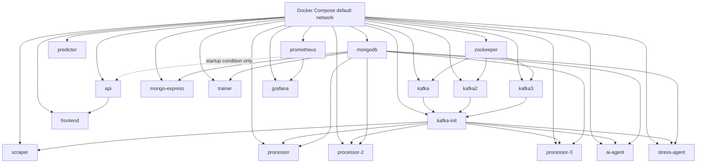

## 5. Producer flow

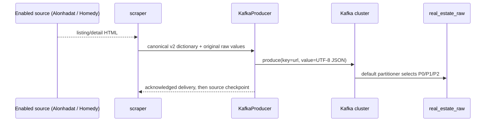

The producer uses the bootstrap list `kafka:29092,kafka2:29093,kafka3:29094`
inside Compose (or `localhost:9092,localhost:9093,localhost:9094` from the
host), retries delivery, and keeps scraper resume state under
`runtime/scrape_state/`. There is no external API key in the Kafka path.

## 6. Consumer and processor flow

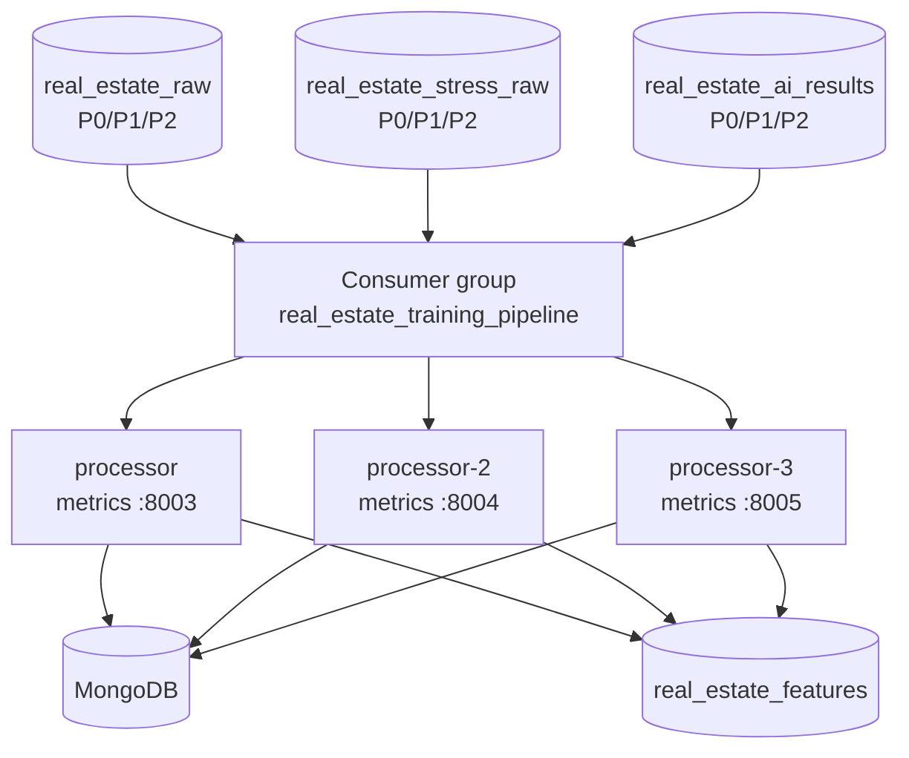

All workers use `enable.auto.commit=false`, `auto.offset.reset=earliest`, and
`enable.auto.offset.store=false`, and `max.poll.interval.ms=900000`. A worker
persists MongoDB or acknowledges the required AI hand-off, then calls
`commit(asynchronous=False)`. It subsequently attempts a diagnostic
`offset_checkpoint` write; Kafka's committed offset is authoritative. URL
upserts and durable result receipts tolerate completed redeliveries. The
fingerprint is a comparison value, not a unique cross-URL deduplication key.
Malformed bytes must reach `dlq_raw` before commit. Raw/feature/invalid write
failures and commit failures stop the loop without advancing to a later offset;
Compose restarts it. This is at-least-once, not exactly-once processing.

When a worker joins or leaves, Kafka pauses assignment and rebalances the same
group. A failed worker's partitions across all three subscribed topics are
assigned to remaining members. A returning worker triggers another rebalance.
For one three-partition topic, two members normally split its partitions 2/1;
the same pattern can repeat across topics. Kafka delivers a partition to only
one active owner in the group, although failures can cause replay.

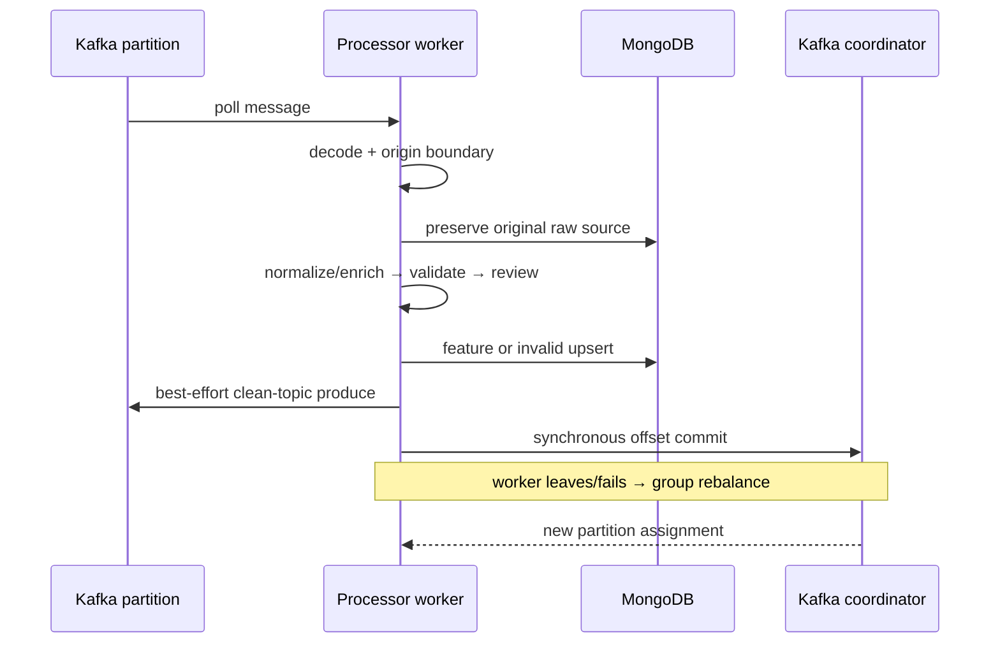

## 7. Detailed processor flow

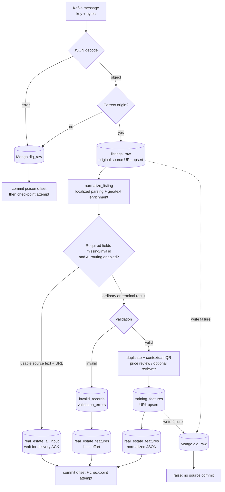

The implementation does not call Spark, a remote embedding service, or an LLM
by default. It stores deterministic local text vectors/cache fields and review
annotations. Mongo writes use unique URL indexes; duplicate payloads are
recognized by `listing_fingerprint`, which includes URL and selected content.
Different URLs are not collapsed by a semantic/fuzzy deduplicator. The diagram
describes the shared processing routine: result handling calls it with
`raw_already_saved=True`, so the source is not overwritten and AI cannot loop.
Audit output goes to the real or stress clean topic according to origin.

AI routing is deliberately narrower than "any bad record". It requires an
unusable required price, area or property type, a URL and extractable source
text, with no normalization exception or terminal AI status. Malformed JSON
takes the durable Mongo-DLQ path; normalization exceptions take the invalid
record path without calling the LLM. With AI disabled, the existing parser's
optional/missing-field behavior is preserved: a partially populated record may
be stored, but feature coverage and candidate checks still govern training.

### Asynchronous AI result hand-off

```mermaid
sequenceDiagram
    participant P as Processor group
    participant M as Origin-specific MongoDB
    participant Q as real_estate_ai_input
    participant A as ai-agent
    participant L as External HTTPS provider
    participant R as real_estate_ai_results
    participant D as real_estate_ai_dlq
    P->>M: Raw source + source-version hash
    P->>Q: Request; wait for broker ACK
    Note over P,Q: Commit original raw/stress offset after ACK
    Q->>A: Poll request
    A->>M: Check latest source and durable caches
    opt No reusable successful extraction
        A->>L: Bounded JSON-only extraction request
        L-->>A: Structured fields, evidence and confidence
        A->>A: Schema/evidence/business validation
        A->>M: Save extraction state and successful response cache
    end
    A->>R: Success or bounded failure; wait for ACK
    Note over A,R: Commit AI request offset after ACK and state save
    R->>P: Poll result in existing Processor group
    P->>M: Check source version and receipt
    P->>P: Preserve provenance; deterministic validation, no AI loop
    P->>M: Features or invalid record in correct database
    opt Terminal extraction/validation failure
        P->>M: ai_failures
        P->>D: Failure envelope; wait for ACK
    end
    P->>M: Completed result receipt
    Note over P,R: Commit result offset after required persistence/delivery
```

No result-to-request loop or automatic DLQ replay worker exists. Malformed AI
request bytes take the worker's direct acknowledged Kafka-DLQ path. Malformed
AI result envelopes take the Processor's durable Mongo-DLQ path.

## 8. Database and storage flow

| Logical layer | Actual storage | Writer | Reader/lifecycle |
| --- | --- | --- | --- |
| Raw/Bronze equivalent | Mongo `real_estate_db.listings_raw` | Processor workers | Latest payload per URL; upserted on updates |
| Invalid/DLQ | Mongo `invalid_records`, `dlq_raw` | Processor workers | Manual investigation/replay; no TTL configured |
| Silver/training features | Mongo `training_features` | Processor workers | Trainer candidate query and API-independent analytics |
| Clean audit stream | Kafka `real_estate_features` | Processor workers | No in-repository consumer |
| Anomaly baseline | Mongo `price_anomaly_thresholds` | Processor detector | Reused until refresh TTL |
| Offset state | Mongo `offset_checkpoint` + Kafka `__consumer_offsets` | Processor/Kafka | Recovery and group diagnostics |
| Model artifact | `artifacts/models/*.joblib`, metadata/metrics JSON | Trainer | API and predictor; host-mounted |
| Local state/cache | `runtime/scrape_state`, `runtime/text_embedding_cache.sqlite` | Scraper/processor | Recomputable; not a data lake |
| Isolated stress storage | Same collection names under `real_estate_stress_db` | Existing Processor stress branch | Test inspection only; never primary model training |
| AI event state | `ai_extractions` in the origin database, `_id=event_id` | AI worker | Saves extraction before result publish; suppresses completed repeated requests |
| AI successful-response cache | `ai_response_cache`, content/provider/model/settings key | AI worker | Exact-input reuse across timestamp-only changes; no TTL configured |
| Result receipts | `ai_result_receipts`, `_id=event_id` | Processor result handler | Completed replay suppression, outcome and timestamp |
| AI failure review | `ai_failures`, `_id=event_id`; Kafka `real_estate_ai_dlq` | Result handler / AI worker | Manual recovery, no automatic replay or expiry |
| Stress run artifacts | `runtime/stress/<run_id>/` | Stress agent | Run marker, report and ground truth outside Kafka; repeated claimed IDs do not rerun |

## 9. ETL and machine-learning flow

There is no Spark driver/executor. Normalization and feature engineering execute
inside each processor worker. Training is a local Python process in
`real_estate_trainer`:

```mermaid
flowchart LR
    TF[(real_estate_db.training_features)] --> Q[Real-data candidate query<br/>price + coverage + anomaly policy]
    Q --> Guard[Model-level real_records filter<br/>also protects manual JSON training]
    Guard --> F[build_feature_frame<br/>geo/text/structured columns]
    F --> Split[80/20 train/test<br/>random_state=42]
    Split --> Prep[numeric impute/scale<br/>categorical one-hot<br/>TF-IDF text]
    Prep --> Ens[TransformedTargetRegressor<br/>Ridge + HistGradientBoosting + SGD voting]
    Ens --> Eval[MAE/RMSE/R²/MAPE]
    Eval --> Art[(versioned joblib<br/>metadata + stable copy)]
    Art --> API[FastAPI /predict]
```

The target is `price_vnd` transformed with `log1p`/`expm1`. The trainer writes
`artifacts/models/price_model.joblib`, versioned joblibs/metadata, and
`artifacts/price_model_metrics.json`. The API reloads the stable artifact when
its mtime changes; a missing artifact yields a controlled 503 from prediction
routes while `/health` reports `initializing`.

Synthetic safety is independent of anomaly policy: ingestion rejects marked
synthetic data on the live topic; the stress branch writes a distinct database;
normalization marks synthetic records non-candidates; automatic/manual Mongo
queries exclude synthetic markers; `RealEstatePriceModel.train()` and
`evaluate_feature_variants()` repeat the in-memory exclusion before feature
construction. The manual JSON loader itself returns JSON unchanged, but these
shared model-level gates protect training and evaluation. Removing provenance
from arbitrary third-party data cannot be detected with certainty.

## 10. API and frontend request flow

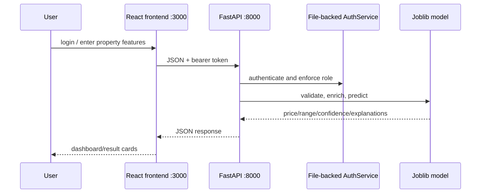

Main API endpoints are `GET /health`, `POST /auth/register`, `POST /auth/login`,
`GET /auth/me`, `GET /auth/roles`, admin `GET/PATCH /auth/users...`, manager/admin
`GET /model/info`, user+ `POST /predict`, and manager/admin `POST /predict/batch`.
The frontend is a single React/Vite app served by Nginx; Axios stores the token
in `localStorage`. The API currently does not query MongoDB; its Compose Mongo
dependency is a conservative startup ordering constraint.

## 11. Monitoring flow

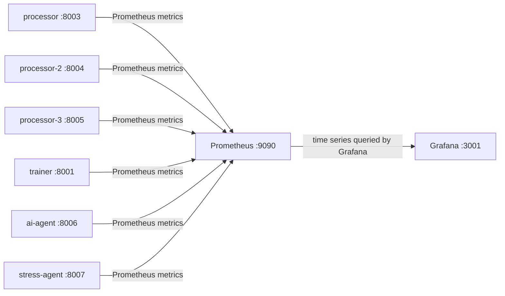

Processor workers, trainer and both agents expose custom metrics.
Processor metrics include consumed/processed/failed counters, consumer lag,
processing duration, and Mongo write success/failure. Trainer metrics include
training duration, sample count, MAE/RMSE/R² and freshness. Prometheus scrapes
all three processor endpoints, trainer, both agents and itself every 15 seconds using
`monitoring/prometheus.yml`; Grafana provisions the Prometheus datasource and
dashboard. API, scraper, predictor and Kafka JMX metrics are not exposed by
the repository's Prometheus configuration.

AI metrics are implemented in `agents/metrics.py` and `agents/worker.py`:
`ai_extraction_requests_total`, success/failure/provider-call/retry counters,
`ai_extraction_duration_seconds`, validation/rate-limit counters,
`ai_extraction_inflight`, circuit state, `ai_cached_results_total`,
`ai_records_completed_total`, `ai_dlq_total`, `ai_consumer_lag` by partition and
`ai_assigned_partitions`. AI lag uses committed offsets; legacy Processor lag
is the latest polled message's partition estimate, not aggregate group lag.
Processor AI-routing counters and stress generation/delivery/duplicate/error
metrics are also exposed. Prometheus uses A-record DNS discovery for AI
replicas on port 8006 and a static stress target on port 8007. Metrics existing
does not imply every series has a dedicated Grafana panel.
Prometheus loads the existing alert-rule file, but the configured Alertmanager
target list is empty; no external alert-notification delivery is implemented.

## 12. Startup dependencies

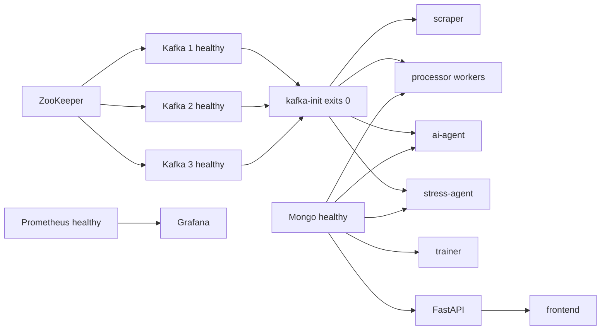

`docker compose up -d` starts ZooKeeper and all brokers, waits for their
healthchecks, runs the one-shot topic/replica initializer, then starts scraper
and all processor workers and agents. Ordinary `up -d` does not guarantee that
an already-completed initializer is recreated: inspect topics and explicitly
run the existing initializer when introducing topics into an older stack. No
`down -v` is required; the named Mongo volume preserves data. Broker and
ZooKeeper data have no explicit persistent volumes in this Compose file.

## 13. External dependencies

| Dependency | Caller | Data crossing boundary |
| --- | --- | --- |
| `alonhadat.com.vn`, `homedy.com` | Opt-in source adapters | HTML to canonical v2; bounded live samples, not bulk readiness |
| `guland.vn` | Offline adapter only | Live disabled pending permission and schema review |
| Kafka/ZooKeeper images | Compose | Listing messages, group offsets |
| MongoDB image | Processor/trainer (and development UI) | Documents, baselines, checkpoints, candidate queries |
| npm/Python registries | Builds only | Packages; no runtime business data |
| Configured external HTTPS LLM endpoint | `ai-agent` only when enabled | Allowlisted listing text/facts out; JSON extraction in; API key sent only as authorization header |

The default runtime does not call an LLM, hosted embedding API, cloud object
store, or external prediction service.

`AIExtractionProvider` separates extraction from the
`OpenAICompatibleProvider` transport. Compose defaults its base URL to Groq's
OpenAI-compatible endpoint, but neither a model nor API key is provided.
`LLM_PROVIDER`, `LLM_BASE_URL`, `LLM_MODEL` and `LLM_API_KEY` configure another
compatible external service. Provider account/free-tier availability and quotas
must be checked with the provider; no free or unlimited-use guarantee is made.
Only the AI container receives the key from ignored `.env`; never print a
resolved Compose configuration containing credentials in a public report.

The extraction schema is strict JSON with nullable fields, evidence quotations
and confidence. Existing parseable structured fields are preserved. Missing
facts must not be guessed. The configured defaults are a 30-second request
timeout, at most three transient retries, a 120-second total extraction budget,
20 provider attempts/minute, one in-flight slot, and a circuit opening after
five provider failures for 60 seconds. The Kafka loop processes one request at
a time even if its semaphore ceiling is raised. Rate/circuit/busy rejection is
a recoverable terminal result, not unbounded waiting. Limits are per process;
operators must divide their API quota before scaling AI replicas.

## 14. Known architecture issues and boundaries

1. The three brokers share one local Docker host; replication does not protect
   against host loss. ZooKeeper mode is retained for compatibility with the
   pinned Confluent image.
2. `real_estate_features` has no consumer in this repository; Mongo
   `training_features` is the effective training source.
3. Kafka retention remains the broker default; no application TTL/retention
   policy is configured. Mongo collections likewise have no TTL job.
4. `predictor:8002` is unauthenticated and not wired to the frontend. Compose
   publishes it on the host without a loopback-only binding; restrict access to
   a trusted development network. Removal requires a separately approved change.
5. Raw storage is a latest-by-URL upsert, not an immutable event history.
6. Scraped coordinates are normally absent; geographic features therefore use
   the implemented missing/status behavior.
7. Prometheus does not scrape broker/JMX metrics, so broker CPU/ISR metrics are
   not available in Grafana without adding a separately approved exporter.
8. Kafka commits, Mongo writes and API calls do not share a transaction. A crash
   after an API call but before cache persistence can repeat the call; a crash
   around an acknowledged Kafka send can repeat delivery. URL upserts, cached
   results and receipts mitigate this but do not provide exactly-once semantics.
9. Source-version checks before/after extraction and during result handling
   reject known stale output; a concurrent newer raw upsert remains a
   cross-collection race, not an atomic compare-and-write transaction.
10. Synthetic tests share the original workers and Kafka infrastructure, so
    isolation protects training data, not live ingestion latency/capacity.
11. LLM evidence quotations and business validation reject many invalid outputs
    but do not prove numeric interpretation or real-world truth. There is no
    calibrated extraction-confidence or human-approval gate for successful real
    AI-derived candidates.

## 15. Runtime audit inventory

| Classification | Current evidence |
| --- | --- |
| KEEP | Compose services, all imported Python modules, scraper/processor/trainer/API/frontend sources, Kafka init script, tests, monitoring configuration, mounted model/auth artifacts |
| POSSIBLY UNUSED | Generic `modeling/Dockerfile`, manual export/quality CLIs, legacy `.vscode` tasks, legacy predictor (separate legacy entrypoint) |
| GENERATED/CACHE | Python `__pycache__`, `.pytest_cache`, `frontend/node_modules`, `frontend/dist`, runtime text cache and scraper state; ignored/recreatable |
| DEFINITELY UNUSED / REMOVED | None in this redesign; no source or model artifact was deleted without a reference/runtime proof |
