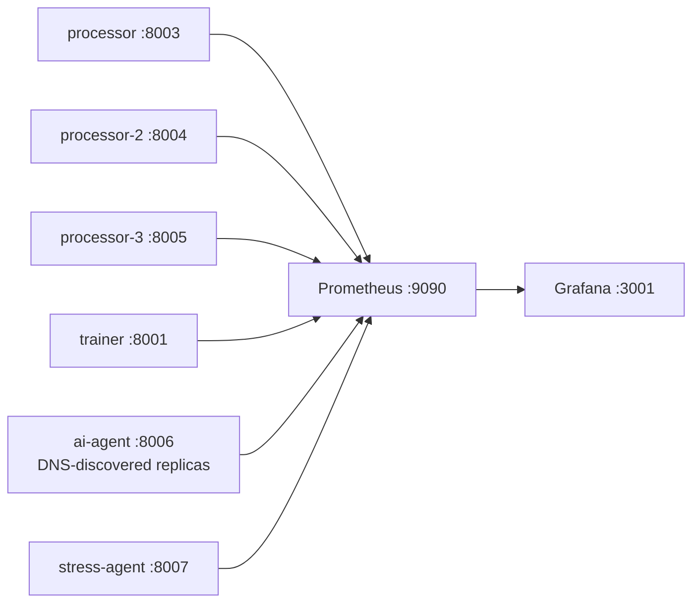

# Monitoring and alerting (implemented)

The current monitoring stack is Prometheus plus Grafana. It does not include
ELK/Elasticsearch, Jaeger, Alertmanager, PagerDuty, Slack or a separate logging
backend. See [ARCHITECTURE.md](ARCHITECTURE.md) for service topology.

## Data flow



Prometheus loads `monitoring/prometheus.yml`, scrapes every 15 seconds and
loads rules from `monitoring/alert_rules.yml`. Targets are
`processor:8003`, `processor-2:8004`, `processor-3:8005`, `trainer:8001`,
`stress-agent:8007`, DNS-discovered `ai-agent` addresses on port 8006 and
`localhost:9090`. Agent ports are not published to the host. AI DNS discovery
refreshes every 15 seconds, allowing multiple AI consumer replicas.

## Exported metrics

### Processor

- `kafka_messages_consumed_total`
- `kafka_messages_processed_total`
- `kafka_messages_failed_total`
- `kafka_consumer_lag`
- `processing_duration_seconds`
- `db_writes_success_total`
- `db_writes_failed_total`

Additional Processor integration metrics are
`processor_ai_requests_total{outcome}`,
`processor_ai_enqueue_duration_seconds` and
`processor_synthetic_rejected_total`. Request enqueue latency ends at Kafka
acknowledgment; it is not external LLM latency.

### Trainer

- `model_train_duration_seconds`
- `model_mae_vnd`
- `model_rmse_vnd`
- `model_r2`
- `model_sample_count`
- `trainer_runs_total`, `trainer_runs_failed_total`
- `trainer_last_run_timestamp_seconds`
- `trainer_last_success_timestamp_seconds`

### AI extraction and worker

Implemented in `agents/metrics.py` and `agents/worker.py`:

- `ai_extraction_requests_total`, `ai_extraction_success_total`,
  `ai_extraction_failure_total{reason}`, `ai_extraction_disabled_total`
- `ai_extraction_duration_seconds`, `ai_extraction_confidence`
- `ai_extraction_retries_total`, `ai_extraction_provider_calls_total`
- `ai_extraction_inflight`, `ai_extraction_circuit_open`
- `ai_validation_success_total`, `ai_validation_failure_total{reason}`
- `ai_rate_limit_events_total{source}`, `ai_extraction_fallback_total{reason}`
- `ai_agent_enabled`, `ai_assigned_partitions`, `ai_consumer_lag{partition}`
- `ai_records_completed_total{outcome}`, `ai_dlq_total`, `ai_cached_results_total`

`ai_consumer_lag` is the high watermark minus the committed next offset,
updated every 15 seconds by enabled workers. Disabled workers expose health
and metrics but do not consume or emit partition lag series. A completed AI
record means the request was durably handled and committed; it does not mean
the downstream Processor already persisted its result. `ai_dlq_total` counts
worker-published malformed-request failures, not every Processor-side rejection.
Confidence is provider-reported and not calibrated accuracy.

### Stress generator

Implemented in `agents/stress_metrics.py`:

- `stress_generated_messages_total{scenario}`
- `stress_delivered_messages_total{scenario}`
- `stress_failed_messages_total{reason}`
- `stress_duplicate_messages_total`, `stress_unstructured_messages_total`
- `stress_run_active`, `stress_burst_active`
- `stress_delivery_rate_per_second`, `stress_run_duration_seconds`

Delivery means a broker acknowledgment, not a successful MongoDB write. The
delivery-rate gauge is the average over the elapsed run; use counter `rate()`
for a windowed rate. Scenario/reason labels are bounded; run IDs remain in logs
and run files, not metric labels. Existing Processor metrics aggregate real,
stress and AI-result work and do not provide per-origin throughput.

For example, query in Prometheus or Grafana Explore:

```promql
sum(rate(ai_extraction_provider_calls_total[5m]))
sum(rate(ai_cached_results_total[5m]))
sum(ai_consumer_lag)
sum(rate(stress_delivered_messages_total[5m]))
sum(rate(ai_extraction_failure_total[5m])) by (reason)
```

The API, scraper and legacy predictor do not expose Prometheus metrics. Docker
healthchecks independently probe API/predictor health; the scraper has no
Compose healthcheck and must be inspected through logs and actual output.

## Configured alert rules

Rules and exact expressions live in `monitoring/alert_rules.yml`:

| Alert | Condition | For |
| --- | --- | --- |
| `HighProcessingErrorRate` | failed/consumed rate > 5% | 5m |
| `HighKafkaConsumerLag` | `kafka_consumer_lag > 1000` | 5m |
| `ProcessingDurationAnomaly` | average processing duration > 5s | 5m |
| `ModelTrainingFailed` | any failed trainer run in the last hour | 10m |
| `ModelTrainingStale` | no successful training for 12h | 15m |
| `DatabaseWriteFailures` | database write failure rate > 0 | 5m |

No notification receiver is configured. Alerts are visible in Prometheus and
the provisioned Grafana dashboard; external paging requires a separately
approved Alertmanager/notification integration.
The existing dashboard and six rules have not been extended with dedicated AI
or stress panels/alerts. Agent series are nevertheless scraped and queryable.

## Access and verification

- Prometheus: `http://localhost:9090`, including `/targets` and `/alerts`.
- Grafana: `http://localhost:3001`; the dashboard is provisioned from
  `monitoring/grafana/dashboards/real_estate_pipeline.json`.
- Processor metrics: `http://localhost:8003/metrics`,
  `http://localhost:8004/metrics`, `http://localhost:8005/metrics`.
- Trainer metrics: `http://localhost:8001/metrics`.

```bash
docker compose up -d prometheus grafana processor processor-2 processor-3 trainer ai-agent stress-agent
docker compose logs --tail=200 prometheus grafana ai-agent stress-agent
docker compose exec -T ai-agent curl -fsS http://localhost:8006/metrics
docker compose exec -T stress-agent curl -fsS http://localhost:8007/metrics
```
