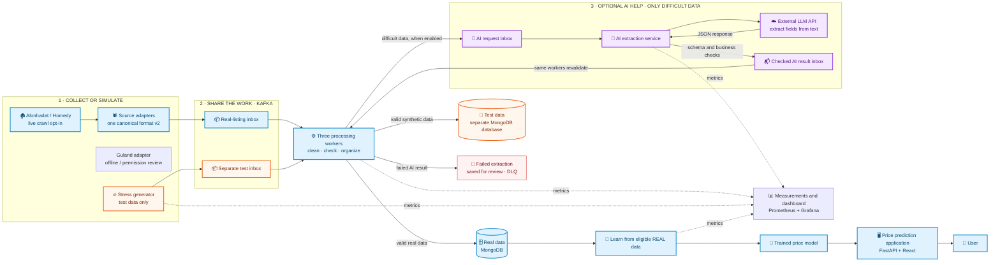

# 🏠 Project Flow — One Visual Reference

Read the large picture from left to right. **Blue** is the normal property-data
path. **Orange** is a separate stress-test path. **Purple** is optional AI help
for data the normal parser cannot reliably read. The AI never replaces the
three existing processing workers.

[Open the full-size, zoomable diagram](docs/assets/project-flow.svg).

The selected adapter set is Alonhadat, Guland and Homedy. Alonhadat/Homedy are
configurable live sources, but automatic crawling is disabled by default.
Guland is offline-only pending permission/live review. Batdongsan is removed
from active selection. The optional
[Homedy source trial](README.md#alternative-source-trial-not-scheduled-ingestion)
only writes local files under ignored `runtime/source_trials/`; it is not
connected to Kafka, MongoDB or training and is not a replacement data source.
Its partial results are recorded in [project status](docs/PROJECT_STATUS.md#homedy-source-trial--2026-09-10).

## The story in plain language

1. A collector reads real property listings. Three workers share the cleaning
   work, and save usable results in the real-data database.
2. A separate generator deliberately makes test listings, duplicates, missing
   fields and messy text. Those records use a separate inbox and test database.
   **Synthetic records never enter the primary model's training dataset.**
3. If enabled, a worker sends difficult data to an AI inbox. The AI service
   asks an external language model to extract fields, validates its JSON, and
   sends the result back through a result inbox. The same processing workers
   validate it again before storing it. Failed extractions are kept for review.
4. Training learns only from eligible real data. The application uses the
   trained price model—not an LLM—to answer the user's prediction request.

Both generation and AI API calls are disabled by default. No API key is needed
to run the normal system. Enabling real-data AI does not enable stress-data AI.

Editable source of the simple visual

## Technical architecture reference

The existing technical diagram is retained below and extended to match the
implemented Agent queues. Worker-to-partition arrows are illustrative: Kafka
assigns **nine partitions across three subscribed topics** to the three workers.
Assignments change during a rebalance; no partition is permanently tied to a
named worker. All seven application topics have 3 partitions, RF=3 and min ISR=2.

```mermaid
flowchart LR
    subgraph Collect["1 · COLLECT PROPERTY DATA"]
        direction TB
        Site["🏠 Alonhadat / Homedy<br/>CRAWL_ENABLED opt-in"]
        Scraper["🕷️ Source-specific adapters<br/>canonical schema v2"]
        Site -->|listing pages| Scraper
    end

    subgraph Distribute["2 · DISTRIBUTE THE WORK"]
        direction TB
        Kafka["📦 Data distribution center<br/>Kafka cluster · ZooKeeper"]
        Brokers["🏢 Three Kafka servers<br/>broker IDs 1 · 2 · 3<br/>host ports 9092 · 9093 · 9094"]
        Raw[("real_estate_raw<br/>3 partitions · replication factor 3<br/>minimum in-sync replicas 2")]
        P0["📥 Lane 0<br/>Partition 0"]
        P1["📥 Lane 1<br/>Partition 1"]
        P2["📥 Lane 2<br/>Partition 2"]

        Kafka --> Brokers --> Raw
        Raw --> P0
        Raw --> P1
        Raw --> P2
    end

    subgraph Process["3 · CLEAN IN PARALLEL"]
        direction TB
        W1["⚙️ Worker 1<br/>processor · :8003"]
        W2["⚙️ Worker 2<br/>processor-2 · :8004"]
        W3["⚙️ Worker 3<br/>processor-3 · :8005"]
        Team["👷 Shared consumer group<br/>real_estate_training_pipeline<br/>raw + stress raw + AI results"]
        Results["🧹 Normalize · validate<br/>enrich · anomaly/review"]

        P0 --> W1
        P1 --> W2
        P2 --> W3
        Team -. membership .-> W1
        Team -. membership .-> W2
        Team -. membership .-> W3
        W1 --> Results
        W2 --> Results
        W3 --> Results
    end

    subgraph Store["4 · STORE THE RESULTS"]
        direction TB
        RawStore[("🗄️ listings_raw<br/>latest raw copy")]
        Features[("📚 training_features<br/>accepted learning examples")]
        Invalid[("🔎 invalid_records<br/>records needing review")]
        DLQ[("🗂️ dlq_raw<br/>unreadable or failed payloads")]
        Clean[("📦 real_estate_features<br/>optional audit stream · no consumer")]

        Results -->|real origin only| RawStore
        Results -->|valid real origin only| Features
        Results -. invalid .-> Invalid
        Results -. failure .-> DLQ
        Results -. normalized audit copy .-> Clean
    end

    subgraph Learn["5 · LEARN FROM HISTORY"]
        direction TB
        Trainer["🧠 Trainer<br/>real_estate_trainer · :8001"]
        Model[("🔮 Price model<br/>artifacts/models/price_model.joblib")]
        Features -. periodic candidate query .-> Trainer
        Trainer -->|train and evaluate| Model
    end

    subgraph Serve["6 · SERVE A PREDICTION"]
        direction TB
        API["🚀 Application API<br/>FastAPI · :8000"]
        UI["🖥️ User interface<br/>React + Nginx · :3000"]
        User["👤 User"]
        Model --> API
        API -->|price response| UI
        UI --> User
    end

    subgraph Watch["7 · WATCH THE SYSTEM"]
        direction TB
        Prom["📡 Prometheus<br/>worker · trainer · AI · stress metrics · :9090"]
        Graf["📊 Grafana<br/>dashboard · :3001"]
        Prom --> Graf
    end

    subgraph Agents["OPTIONAL AGENT PATHS · DISABLED BY DEFAULT"]
        StressAgent["stress-agent<br/>deterministic templates · metrics :8007"]
        StressTopic[("real_estate_stress_raw")]
        StressDB[("real_estate_stress_db<br/>same collection names · never main training")]
        StressClean[("real_estate_stress_features<br/>best-effort audit · no consumer")]
        AIRequest[("real_estate_ai_input")]
        AIAgent["ai-agent · metrics :8006<br/>group real_estate_ai_extraction<br/>cache · rate limit · bounded retry"]
        Provider["External HTTPS LLM<br/>configured provider + model"]
        AIResult[("real_estate_ai_results")]
        AIDLQ[("real_estate_ai_dlq<br/>manual review · no auto-retry consumer")]
        ResultHandler["AI result handler inside SAME processors<br/>validate · preserve provenance · URL upsert"]
        StressAgent --> StressTopic
        StressTopic -->|same three workers| Results
        Results -->|synthetic only| StressDB
        Results -. synthetic audit .-> StressClean
        Results -->|difficult, gate enabled; archive then ACK enqueue| AIRequest
        AIRequest --> AIAgent --> Provider
        Provider -->|JSON schema + business checks| AIAgent
        AIAgent -->|ACK result before request commit| AIResult
        AIResult --> ResultHandler
        ResultHandler -->|real result| Features
        ResultHandler -->|synthetic result| StressDB
        ResultHandler -->|failed result, then commit| AIDLQ
        AIAgent -->|malformed request| AIDLQ
        AIAgent -. metrics .-> Prom
        StressAgent -. metrics .-> Prom
    end
    Scraper -->|URL-keyed JSON| Kafka
    W1 -. metrics .-> Prom
    W2 -. metrics .-> Prom
    W3 -. metrics .-> Prom
    Trainer -. metrics .-> Prom
```

Mermaid source for the diagram

## How to read the flow

1. Enabled Alonhadat/Homedy adapters translate their own page structures into
   canonical v2 listings, preserving raw values and nullable fields. Guland is
   disabled for live collection; its fixtures use the same contract. One
   URL-keyed JSON message is published and acknowledged before checkpointing.
2. Kafka keeps real records in `real_estate_raw` and test records in
   `real_estate_stress_raw`. The same three workers also consume
   `real_estate_ai_results`, using one existing consumer group. URL keys preserve
   ordering within each topic/partition, not across the request/result topics.
3. Each processor normalizes and validates the message, enriches text and
   geographic fields, applies duplicate/anomaly review, and writes MongoDB.
   Invalid records go to `invalid_records`; malformed messages are durably
   archived in `dlq_raw` before commit. Failed required Mongo writes or AI queue
   sends leave offsets uncommitted. Both clean topics are best-effort audit
   outputs with no consumer. AI request/result handling is at-least-once, not a
   Kafka/Mongo transaction; completed receipts and content caches reduce replay.
4. The trainer periodically queries eligible MongoDB `training_features`, fits
   the local scikit-learn ensemble, evaluates it, and writes the stable joblib
   artifact. Training is not a Kafka consumer and is not triggered once per
   message.
5. FastAPI loads the model artifact for authenticated `/predict` and
   `/predict/batch` requests. The browser sends prediction input from the React
   UI to FastAPI and receives the price response back in the UI.
6. Prometheus scrapes processors on `8003`–`8005`, trainer on `8001`, AI on
   `8006`, stress generation on `8007`, source crawler on `8008`, and itself. Grafana displays configured
   panels; new metrics can also be queried in Explore. Kafka broker JMX,
   MongoDB, API, and legacy predictor metrics are not scrape targets.

## Runtime facts represented by the diagram

| Area | Current implementation |
| --- | --- |
| Kafka | ZooKeeper mode; brokers `kafka`, `kafka2`, `kafka3`; IDs 1/2/3; internal listeners `29092`/`29093`/`29094`; host listeners `9092`/`9093`/`9094` |
| Raw topic | `real_estate_raw`; 3 partitions; replication factor 3; minimum ISR 2 |
| Topic inventory | `real_estate_raw`, `real_estate_features`, `real_estate_stress_raw`, `real_estate_stress_features`, `real_estate_ai_input`, `real_estate_ai_results`, `real_estate_ai_dlq`; all 3 partitions / RF3 / min ISR2 |
| Consumer groups | `real_estate_training_pipeline`: three Processors, raw + stress raw + AI results. `real_estate_ai_extraction`: AI input only, no active member when disabled. Manual synchronous commits |
| Storage | Real/test databases are separate. Both use raw/features/invalid/DLQ/threshold/checkpoint collections; AI uses `ai_extractions`, `ai_response_cache`, `ai_result_receipts`, `ai_failures` as needed |
| Training | MongoDB candidates → local scikit-learn preprocessing/ensemble → versioned and stable joblib artifacts |
| Serving | Authenticated FastAPI on `8000`; React/Nginx frontend on `3000`; legacy unauthenticated predictor is host-published on `8002`, not used by the UI |
| Monitoring | Prometheus `9090` → Grafana `3001`; Processor/trainer/AI/stress custom metrics; AI discovery supports replicas |

Synthetic safety is enforced by topic/database routing, explicit
`is_synthetic=true`, non-candidate feature generation, Mongo training queries,
manual export queries, and the model's Python/JSON training entry points.

Unimplemented guarantees: global API quota across AI replicas, atomic
cross-collection source-version writes, automatic DLQ replay and cross-URL
near-duplicate merging. No Spark, GPU, local LLM or additional processing team
is introduced. Runtime verification results and environment limitations are in
[`docs/PROJECT_STATUS.md`](docs/PROJECT_STATUS.md).

## Source of truth

This diagram was checked against [`docker-compose.yml`](docker-compose.yml),
[`scripts/init_kafka_cluster.sh`](scripts/init_kafka_cluster.sh), the scraper,
processor, trainer and API source, and
[`monitoring/prometheus.yml`](monitoring/prometheus.yml). The narrative service
and storage details remain in [`docs/ARCHITECTURE.md`](docs/ARCHITECTURE.md).
